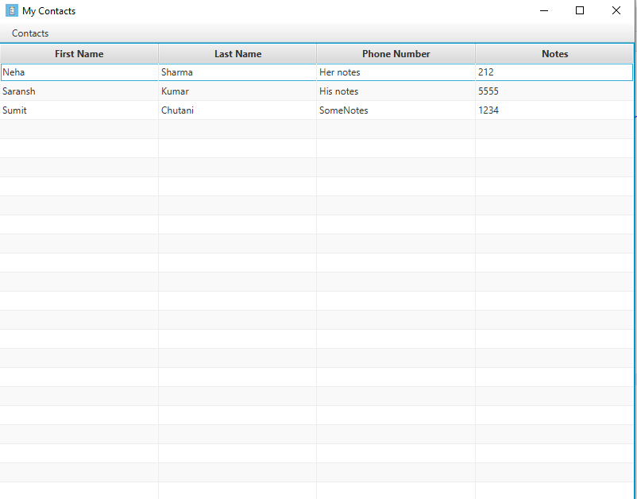

# Mini-JAVA-Projects
These are some of the java codes that I have implemented while I was Learning JAVA

1. Online Registration Form - Console Based application I have created while learning about Arraylists and seeing the current trend of Online Seminars

---

2. HamBurgerShop - Console based application I have created as challenge of implementing OOPS in Java MasterClass Course

---

3. Contacts Application- Desktop Application created using JavaFX framework to store contacts.
  
    Other features implemented:-
    <ul type="square">
    <li>EDIT
    <li>DELETE
    </ul>
    
    
 ---   
 
